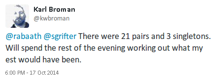

 

 

## Background

Karl Broman is a Professor of Biostatistics at UW-Madison who is a prominent R user and a prolific tweeter. The response of the statistics / R twittersphere was to treat this as a probability modeling problem - based on that sample how many total socks are there and what proportion are paired? Rasmus Bååth, a Ph.D. student in Cognitive Science at Lund University in Sweden, created a [blog post](http://www.sumsar.net/blog/2014/10/tiny-data-and-the-socks-of-karl-broman/) about his approach to the problem using a Bayesian model and Approximate Bayesian Computation to derive his posterior distributions.

 

## Task 1 - Sock Shiny App

Our first goal for this assignment is to reproduce Rasmus' analyses and improve on it by creating a web app that will allow a user to dynamically interact with the analysis by specifying different prior(s) and or parameterizations. You will create this interactive tool using Rstudio's [Shiny](http://shiny.rstudio.com/) package, which is an R framework for web applications that does not require any specific knowledge of HTML, CSS, or Javascript.

Your app should allow the user to select from a range of appropriate priors (and if you are feeling adventurous, parameterizations). Visualizations of the priors and posteriors should also be included and dynamically updated based on the user's selections. You should also include relevant posterior summary statistics (e.g. mean, median, 95\% credible interval, etc.) both on the plots and in a textual form while also allowing the user to turn these on and off. Extra credit will also be awarded for other interesting bells and whistles added to your app (make sure that they actually add value to the analysis).

You should also include the option to show our hide the "true" value which was provided in a follow up tweet.

 

## Task 2 - We need speed. Speed's what we need. 

The analysis we are implementing is based on a computation method called approximate Bayesian computation (ABC) that (in this case) trades complexity for computational efficiency. Here we are able to avoid the difficulty of coming up with a likelihood model for Karl's socks and we instead only need to define a generative model (which is much easier). The cost of this is that naive ABC methods are incredibly computationally inefficient. 

For this analysis we are working with what Rasmus called "Tiny Data" so we will not have to be particularly clever about our approach but to make your implementations as fast as possible you will be expected to add local multithreading to your Shiny app. What this means is that you will need to simulataneous make use of multiple cores where appropriate to achieve the best possible performance for your ABC sampler. We will cover various approach to this in class in the next week and a half.

 

## Work Product

* `ui.R` and `server.R` - these files will contain the implementation of your Shiny app.

* `hw4.Rmd` - write up detailing the specifics of your implementation (e.g. choice of parameterization and priors).

 

## Submission and Grading

This homework is due by 2 pm Saturday, November 14th. You are to complete the assignment as a group and to keep everything (code, write ups, etc.) on your team's github repository (commit early and often). All team members are expected to contribute equally to the completion of this assignment and group assessments will be given at its completion - anyone judged to not have sufficient contributed to the final product will have their grade penalized. While different teams members may have different coding backgrounds and abilities, it is the responsibility of every team member to understand how and why all code in the assignment works.

 
