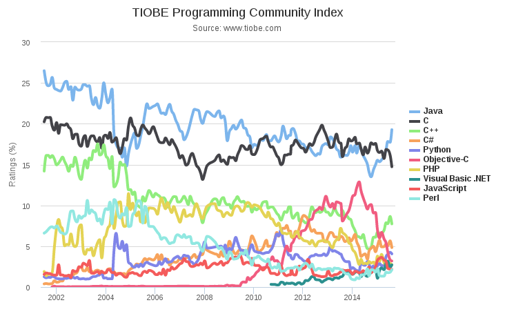
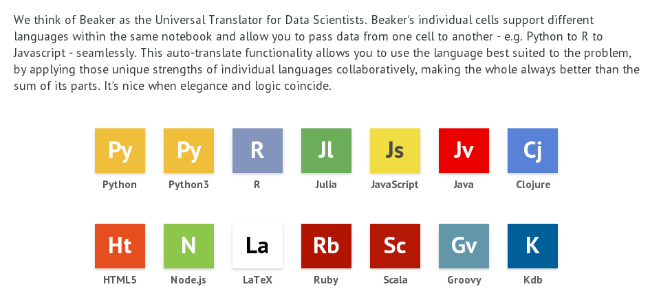
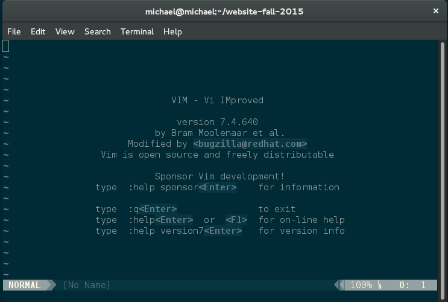
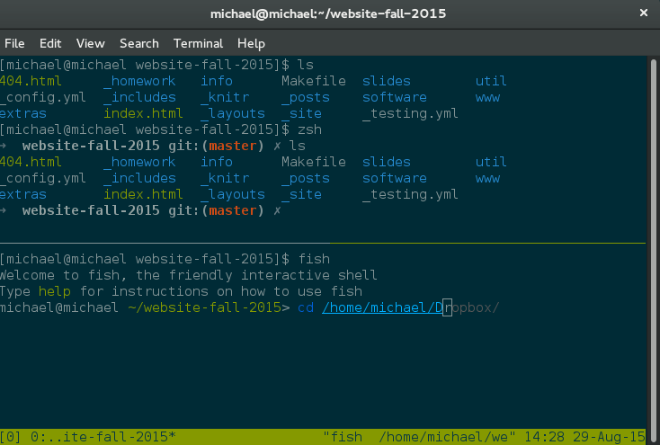
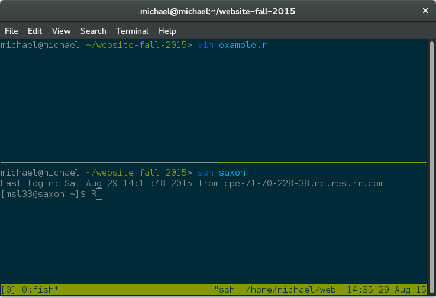
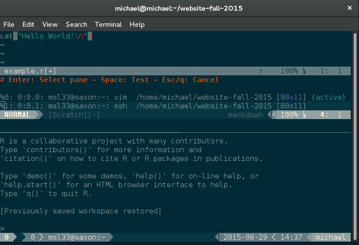
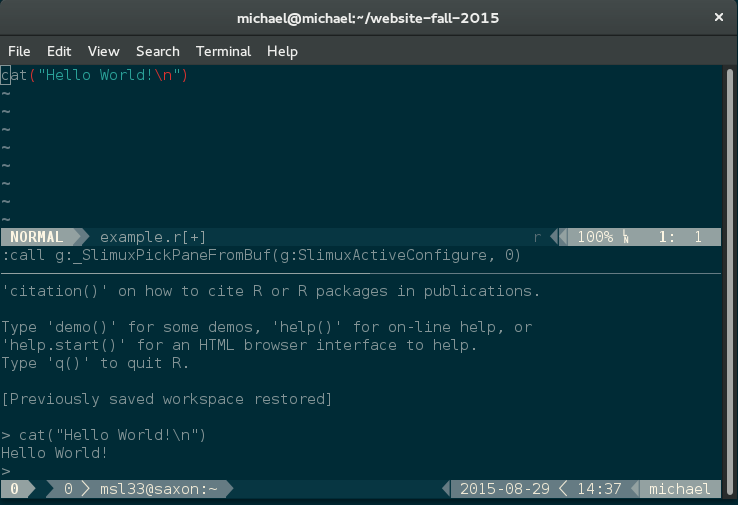
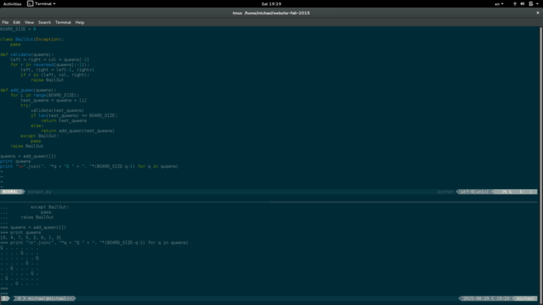

## Outline of Talk

* Programming, the current state of affairs

* In search of the perfect workflow
    * Editors
    * Shells
    * Terminal Multiplexers
    * My Vim + Tmux + remote REPL setup 

* Some Unix utilities often found useful
    * sed
    * awk
    * rsync
#Programming Languages 

##Programming Languages
<div class="centered" style="margin-top: -1em;">

</div>
* There are a lot out there, which one will you choose?

##Codeeval.com
<div class="centered" style="margin-top: -1em;">

</div>

##Open HUB Language Comparison
<div class="centered" style="margin-top: -1em;">

</div>

##Tiobe Index
<div class="centered" style="margin-top: -1em;">

</div>
* The TIOBE Programming Community index rates the popularity of programming languages based on the number of skilled engineers world-wide, courses and third party vendors.

##DataCamp's R vs Python Infographic
<div class="centered" style="margin-top: -1em;">

</div>
* [An excellent comparative study of these two languages for data science!](http://blog.datacamp.com/wp-content/uploads/2015/05/R-vs-Python-216-2.png)

##Kaggle.com
<div class="centered" style="margin-top: -1em;">

</div>

##Can't Decide? - Try Beaker Notebook
<div class="centered" style="margin-top: -1em;">

</div>
  

##My Advice
* R and Python still dominate the data science community
* R is more commonly used in statistical fields
* Python is a much more complete language
* Both are slow
* C++ and Fortran are very fast in execution, but slower in development of code
* Fast running code is great but, as students, should not come at the expense of your productivity
* Your time is precious, your computers time is not.
* There is a trade-off between speed of execution and speed of development
* A nice compromise making its way into data science is [Julia](http://julialang.org/)

#Editors 

##Choosing an Editor
* You will spend a great deal of your lives editing code
    * It is important to do it in a comfortable environment
* A good editor will
    * Free you of your mouse
    * Allow you to rapidly create code
    * Decrease fatigue and increase stamina whilst coding
    * Increase productivity
    * Join a community
    * Make you a happy programmer =)
* Most programmers will vehemently defend their choice of editor (including me)

## linuxquestions.org Editor Poll
<div class="centered" style="margin-top: -1em;">

</div>
 
## Editor Wars

* SWEs are typically very defensive about two things...
    * Their Shell (zsh,fish,bash...)
    * Their Editor (vi,emacs...)

<div class="centering">
<blockquote>
*Editor war is the common name for the rivalry between users of the Emacs and Vi (Vim) text editors. The rivalry has become a lasting part of hacker culture and the free software community.
Many flame wars have been fought between groups insisting that their editor of choice is the paragon of editing perfection, and insulting the others.*
</blockquote>
<cite>--Wikipedia</cite>
</div>

##Vim
<div class="centered" style="margin-top: -1em;">

</div>
##Vim
* Emacs users joke that vi has two modes – "beep repeatedly" and "break everything"
<div class="centered" style="margin-top: -1em;">

</div>

##GNU EMACS
<div class="centered" style="margin-top: -1em;">

</div>

##GNU EMACS
* Apparently stands for "Editing MACroS", however, other alternatives are
    * Escape Meta Alt Control Shift
    * EMACS Makes Any Computer Slow
    * Eventually Munches All Computer Storage
    * Generally Not Used, Except by Middle-Aged Computer Scientists
*  vi users enjoy joking that Emacs's key-sequences induce carpal tunnel syndrome

##GNU EMACS
<div class="centered" style="margin-top: -1em;">

</div>

##I reccommend Vim (of course)
* Vims keybindings may seem unintuitive, but they are optimized in the sense that once learned they allow you to write and navigate code *rapidly*!
* To learn the keybindings, type "vimtutor" into your terminal window on saxon
* Vim is extremely customizeable. If you want to change anything about it, you can.
* Large community providing a huge number of plugins
* Excellent plugins available for autocompletion, fuzzy finding, navigation, language integration etc...
* Ships as standard with most linux distributions.

##Trending Editors: Sublime
<div class="centered" style="margin-top: -1em;">

</div>

##Trending Editors: atom
<div class="centered" style="margin-top: -1em;">

</div>

#Shells
##Shells
* Already have some exposure to bash (bourne again shell)
* Some currently popular shells are
    * zsh "z-shell" especially when combined with oh-my-zsh
    * fish "friendly interactive shell" very user friendly, also oh-my-fish

#Terminal Multiplexers
##Terminal Multiplexers
* Allow you to run multiple terminal sessions within a single terminal window
* Tmux or GNU Screen are most common options
* Most consider Tmux superior to screen.

##Tmux example
<div class="centered" style="margin-top: -1em;">

</div>

##Vim+Tmux+Slimux workflow
* Slimux is a plugin for vim that allows you to send text from vim in one tmux pane to another
* Often useful to have an editor in one tmux pane and an REPL from your favourite language in another
* If the REPL session is on a remote machine then we can edit code locally, but have it execute remotely!
* This means all heavy lifting is done by, say, my office computer whilst my laptop is unburdened and free to watch netflix
* This obsoletes commonly referenced Vim-R-plugin

##Vim+Tmux+Slimux workflow
<div class="centered" style="margin-top: -1em;">

</div>
##Vim+Tmux+Slimux workflow
<div class="centered" style="margin-top: -1em;">

</div>
##Vim+Tmux+Slimux workflow R
<div class="centered" style="margin-top: -1em;">

</div>
##Vim+Tmux+Slimux workflow Julia
<div class="centered" style="margin-top: -1em;">

</div>
##Vim+Tmux+Slimux workflow Python
<div class="centered" style="margin-top: -1em;">

</div>
      
#Some Unix Utilities
##awk
```bash
[michael@michael ~]$ cat sometable.dat 
"Some Description here that your collaborator decided was useful"
"V1" "V2" "V3"
"1" -0.926279001621519 -0.90179685027722 1.97957280153958
"2" 0.937524731204077 -1.23302316044355 -0.180671760736866
"3" -1.44570215269122 0.817268060335293 0.311498702884293
"4" -0.547354824616171 0.827169714956968 -0.462521312697732
"5" -0.290613900109242 2.11331118379395 0.504731900370643
"6" -1.50689928026228 -0.273155683881863 1.61629032009698
"7" -0.154531591553615 0.201957539158184 -2.37144275790015
"8" 1.06123047151248 -0.527749699949128 0.32923487045257
"9" 1.05843977271672 0.510092464005052 -1.06093331871229
"10" 0.0961074300632977 -0.559597700246554 -0.510204378208016
```

##awk
```bash
[michael@michael ~]$ awk '{if (NR!=1 && NR!=2) {print $2, $3, $4}}' sometable.dat 
-0.926279001621519 -0.90179685027722 1.97957280153958
0.937524731204077 -1.23302316044355 -0.180671760736866
-1.44570215269122 0.817268060335293 0.311498702884293
-0.547354824616171 0.827169714956968 -0.462521312697732
-0.290613900109242 2.11331118379395 0.504731900370643
-1.50689928026228 -0.273155683881863 1.61629032009698
-0.154531591553615 0.201957539158184 -2.37144275790015
1.06123047151248 -0.527749699949128 0.32923487045257
1.05843977271672 0.510092464005052 -1.06093331871229
0.0961074300632977 -0.559597700246554 -0.510204378208016
```

##sed (stream editor)
```bash
[michael@michael ~]$ cat sometable.dat 
"0.105774991546184","0.847064147883745","-0.0660739625900144"
"0.991642673113269","-0.910378353936528","0.242019735200752"
"1.18670738365435","-0.0635949990874165","0.0545035172895231"
"0.339030527116908","1.00409816349115","1.05409760045931"
"0.733140277297745","-0.486181059367985","-0.782856940083747"
"0.912168817424054","-0.665072486844399","0.305825741840168"
"0.760501919797442","0.631352260415459","-0.702661487210477"
"-1.78710953318012","0.691635475717654","-1.11995993079623"
"1.48652315899709","-0.248673688916947","0.131737972070439"
"0.903709893442578","0.0485020698381635","0.413212986364045"
```

##sed (stream editor)
```bash
[michael@michael ~]$ sed -e 's/,/ /g' -e 's/"//g' sometable.dat 
0.105774991546184 0.847064147883745 -0.0660739625900144
0.991642673113269 -0.910378353936528 0.242019735200752
1.18670738365435 -0.0635949990874165 0.0545035172895231
0.339030527116908 1.00409816349115 1.05409760045931
0.733140277297745 -0.486181059367985 -0.782856940083747
0.912168817424054 -0.665072486844399 0.305825741840168
0.760501919797442 0.631352260415459 -0.702661487210477
-1.78710953318012 0.691635475717654 -1.11995993079623
1.48652315899709 -0.248673688916947 0.131737972070439
0.903709893442578 0.0485020698381635 0.413212986364045
```

##rsync
* Often used to sync files between local and remote systems

```bash
[michael@michael ~]$ rsync -avzu office:.matlab/myfunctions/figs/ .
receiving incremental file list
./
1_a_0_neg.eps
1_a_0_pos.eps
1_a_10_neg.eps
1_a_10_pos.eps
 
sent 90 bytes  received 12464 bytes  2789.78 bytes/sec
total size is 36238  speedup is 2.89
```

##SSH Keys
* Typing in your password everytime you scp or ssh is tiresome
```bash
lindon@michael-laptop:~$ ssh-keygen
Generating public/private rsa key pair.
Enter file in which to save the key (/home/lindon/.ssh/id_rsa):  
Created directory '/home/lindon/.ssh'.
Enter passphrase (empty for no passphrase):
Enter same passphrase again:
Your identification has been saved in /home/lindon/.ssh/id_rsa.
Your public key has been saved in /home/lindon/.ssh/id_rsa.pub.
```
* When prompted to enter a file, passphrase, same passphrase, simply press return
* The last line will then be succeeded by the key’s fingerprint and random image.
* The public and private key are found in (hidden) the /home/user/.ssh directory

##A note on security
* A public and a private key is generated (don't give the private one out)
* Most strongly advise having a strong passphrase so that if your private key is compromised you still have the passphrase
* However, instead of requiring a password to be entered, it now requires a passphrase to be entered, so nothing has been gained
* I don't have a passphrase, because I get tired of typing it in every single painful time you push or pull something
* As long as you keep your private key PRIVATE, then I wouldn't bother

##Transfer the public key with ssh-copy-id
```bash
lindon@michael-laptop:~$ ssh-copy-id -i lindon@remotecomputer.com
The authenticity of host 'remotecomputer (xx.xxx.xxx.xx)' can't be established.
RSA key fingerprint is   :  :  :  :  :  :  :  :  :  :  :  :  :  :  :  :.
Are you sure you want to continue connecting (yes/no)? yes
Warning: Permanently added 'remotecomputer,xx.xxx.xxx.xx' (RSA) to the list of known hosts.
lindon@remotecomputer's password:
Now try logging into the machine, with "ssh 'lindon@remotecomputer.com'", and check in:

~/.ssh/authorized_keys

to make sure we haven't added extra keys that you weren't expecting.

lindon@michael-laptop:~$
```
* The -i option means that the default public key, i.e. ~/.ssh/id_rsa.pub, is used.

##Login without password
```bash
lindon@michael-laptop:~$ ssh lindon@remotecomputer.com
Welcome to Ubuntu 11.04 (GNU/Linux 2.6.38-11-generic x86_64)

* Documentation:  https://help.ubuntu.com/

Last login: Sun Sep 11 15:57:14 2011 from xx.xxx.xxx.xx
lindon@remotecomputer:~$
```

##SSH Config
* Creating an alias saves a lot of time
```bash
[michael@michael ~]$ cd .ssh
[michael@michael .ssh]$ cat config
Host saxon
HostName saxon.stat.duke.edu
User msl33
[michael@michael .ssh]$ ssh saxon
Last login: Sat Aug 29 19:16:35 2015 from foo.bar.foo.bar.com
[msl33@saxon ~]$ 
```

##[SSH Keys with Gitub](https://help.github.com/articles/generating-ssh-keys/)
* In the top right corner of any page, click your profile photo, then click Settings.
* In the user settings sidebar, click SSH keys.
* Click Add SSH key.
* In the Title field, add a descriptive label for the new key. For example, if you're using a personal Mac, you might call this key "Personal MacBook Air".
* Paste your key into the "Key" field.
* Paste your key into the "Key" field.
* Confirm the action by entering your GitHub password.
* Test
```bash
ssh -T git@github.com
```

##[Switching from HTTP to SSH](https://help.github.com/articles/changing-a-remote-s-url/)
* Most likely you've been pushing/pulling to your github repo over https
* SSH is nicer, and with keys will not require login each time
* To change this for your repository of interest you should switch the remote urls from ssh to http
* Instructions linked in title
