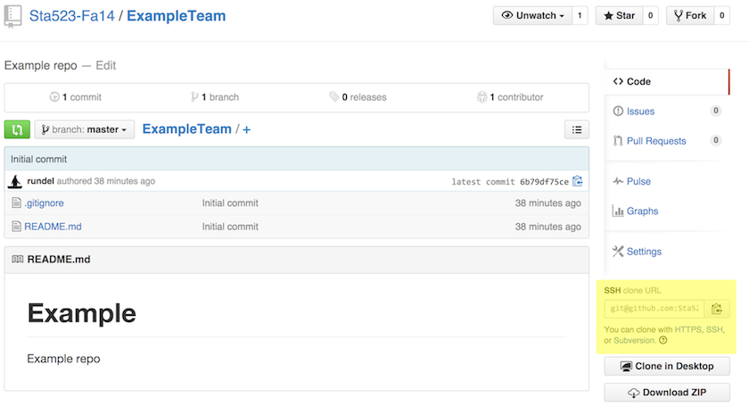
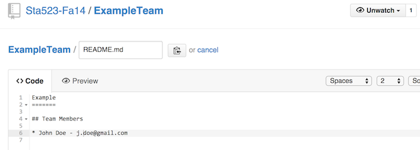
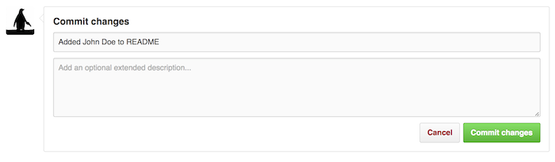
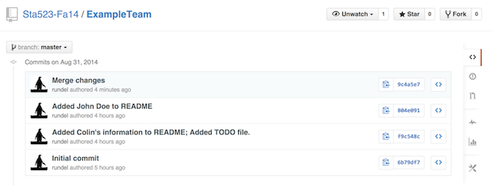

## Outline of Talk

* Programming, the current state of affairs

* In search of the perfect workflow
    * Editors
    * Shells
    * Terminal Multiplexers
    * My Vim + Tmux + remote REPL setup 

* Some Unix utilities often found useful
    * sed
    * awk
    * rsync
#Programming Languages 

##Programming Languages
<div class="centered" style="margin-top: -1em;">

</div>
* There are a lot out there, which one will you choose?

##Codeeval.com
<div class="centered" style="margin-top: -1em;">

</div>

##Open HUB Language Comparison
<div class="centered" style="margin-top: -1em;">

</div>

##Tiobe Index
<div class="centered" style="margin-top: -1em;">

</div>
* The TIOBE Programming Community index rates the popularity of programming languages based on the number of skilled engineers world-wide, courses and third party vendors.

##DataCamp's R vs Python Infographic
<div class="centered" style="margin-top: -1em;">

</div>
* [An excellent comparative study of these two languages for data science!](http://blog.datacamp.com/wp-content/uploads/2015/05/R-vs-Python-216-2.png)

##My Advice
* R and Python still dominate the data science community
* R is more commonly used in statistical fields
* Python is a much more complete language
* Both are slow
* C++ and Fortran are very fast in execution, but slower in development of code
* Fast running code is great but, as students, should not come at the expense of your productivity
* Your time is precious, your computers time is not.
* There is a trade-off between speed of execution and speed of development
* A nice compromise making its way into data science is [Julia](http://julialang.org/)

#Editors 

##Choosing an Editor
* You will spend a great deal of your lives editing code
    * It is important to do it in a comfortable environment
* A good editor will
    * Free you of your mouse
    * Allow you to rapidly create code
    * Decrease fatigue and increase stamina whilst coding
    * Increase productivity
    * Join a community
    * Make you a happy programmer =)
* Most programmers will vehemently defend their choice of editor (including me)

## linuxquestions.org Editor Poll
<div class="centered" style="margin-top: -1em;">

</div>
 
## Editor Wars

* SWEs are typically very defensive about two things...
    * Their Shell (zsh,fish,bash...)
    * Their Editor (vi,emacs...)

<div class="centering">
<blockquote>
*Editor war is the common name for the rivalry between users of the Emacs and Vi (Vim) text editors. The rivalry has become a lasting part of hacker culture and the free software community.
Many flame wars have been fought between groups insisting that their editor of choice is the paragon of editing perfection, and insulting the others.*
</blockquote>
<cite>--Wikipedia</cite>
</div>

##Vim
<div class="centered" style="margin-top: -1em;">

</div>
##Vim
* Emacs users joke that vi has two modes – "beep repeatedly" and "break everything"
<div class="centered" style="margin-top: -1em;">

</div>

##GNU EMACS
<div class="centered" style="margin-top: -1em;">

</div>

##GNU EMACS
* Apparently stands for "Editing MACroS", however, other alternatives are
    * Escape Meta Alt Control Shift
    * EMACS Makes Any Computer Slow
    * Eventually Munches All Computer Storage
    * Generally Not Used, Except by Middle-Aged Computer Scientists
*  vi users enjoy joking that Emacs's key-sequences induce carpal tunnel syndrome

##GNU EMACS
<div class="centered" style="margin-top: -1em;">

</div>

##I reccommend Vim (of course)
* Vims keybindings may seem unintuitive, but they are optimized in the sense that once learned they allow you to write and navigate code *rapidly*!
* To learn the keybindings, type "vimtutor" into your terminal window on saxon
* Vim is extremely customizeable. If you want to change anything about it, you can.
* Large community providing a huge number of plugins
* Excellent plugins available for autocompletion, fuzzy finding, navigation, language integration etc...
* Ships as standard with most linux distributions.

#Shells
##Shells
* Already have some exposure to bash (bourne again shell)
* Some currently popular shells are
    * zsh "z-shell" especially when combined with oh-my-zsh
    * fish "friendly interactive shell"

# Git Demo

## Some initial configuration

We want to let `git` know who we are so there are some simple configuration options we should setup.

Let's first tell `git` who we are, and what editor we want to use.

```bash
$ git config --global user.name "Colin Rundel"
$ git config --global user.email "rundel@gmail.com"
$ git config --global color.ui true
$ git config --global core.editor nano
```

We also want to set this up on saxon too, so

```bash
$ ssh cr173@saxon.stat.duke.edu
cr173@saxon [~]$ git config --global user.name "Colin Rundel"
...
```

## Some initial configuration

Make sure to put this information in your github profile as well.


## Working with github {.smaller}

I've already created a repository for each team on the [course's github page](https://github.com/Sta523-Fa15/). What we are going to do now is create a local copy of that repository on saxon - to do this we will use git's `clone` command, which needs the repositories url:





## Cloning a repository

```bash
cr173@saxon [Sta523]$ git clone git@github.com:Sta523-Fa15/TeamExample.git
Cloning into 'TeamExample'...
remote: Counting objects: 3, done.
remote: Total 3 (delta 0), reused 0 (delta 0), pack-reused 0
Receiving objects: 100% (3/3), done.
```

```bash
cr173@saxon [Sta523]$ ls
TeamExample
cr173@saxon [Sta523]$ ls -a TeamExample/
.  ..  .git  README.md
```

## Checking the status

```bash
cr173@saxon [Sta523]$ cd TeamExample
cr173@saxon [TeamExample]$ git status
On branch master
Your branch is up-to-date with 'origin/master'.
nothing to commit, working directory clean
```

## Making changes

Lets edit the `README.md` file to include team member names and email addresses.

```bash
cr173@saxon [TeamExample]$ cat README.md
# TeamExample

Example repo
```

```bash
cr173@saxon [TeamExample]$ nano README.md
cr173@saxon [TeamExample]$ cat README.md
# TeamExample's Repo

## Team Members

* Colin Rundel - rundel@gmail.com
```

## Checking the status again

```bash
cr173@saxon [TeamExample]$ git status
On branch master
Your branch is up-to-date with 'origin/master'.
Changes not staged for commit:
  (use "git add <file>..." to update what will be committed)
  (use "git checkout -- <file>..." to discard changes in working directory)

    modified:   README.md

no changes added to commit (use "git add" and/or "git commit -a")
```

## Adding a new file {.smaller}

```bash
cr173@saxon [TeamExample]$ echo -e "* Add other team member's info\n* Fix formatting\n" > TODO
cr173@saxon [TeamExample]$ cat TODO
* Add other team member's info
* Fix formatting

```

## Checking the status yet again

```bash
cr173@saxon [TeamExample]$ git status
On branch master
Your branch is up-to-date with 'origin/master'.
Changes not staged for commit:
  (use "git add <file>..." to update what will be committed)
  (use "git checkout -- <file>..." to discard changes in working directory)

    modified:   README.md

Untracked files:
  (use "git add <file>..." to include in what will be committed)

    TODO

no changes added to commit (use "git add" and/or "git commit -a")
```

## Lets save our changes

* One file `README.md` is tracked and modified (repo is already has this file but our current version differs from the previously saved version)

* The other file `TODO` is untracked (this file does not exist in the repo)

Our next step is the same for both files - we want to *stage* our changes using `git add`.

```bash
cr173@saxon [TeamExample]$ git add README.md
cr173@saxon [TeamExample]$ git add TODO
```

##

```bash
cr173@saxon [TeamExample]$ git status
On branch master
Your branch is up-to-date with 'origin/master'.
Changes to be committed:
  (use "git reset HEAD <file>..." to unstage)

    modified:   README.md
    new file:   TODO

```

## What is staging?

By using `git add` we have made git aware of the current version of both files, but we have not actually saved the changes yet.

To save the changes (locally) we need to *commit* them using `git commit`, since this change will be saved it is customary to add a message about the nature of the changes being made (for future reference).

```bash
cr173@saxon [TeamExample]$ git commit -m "Added Colin's information to README; Added TODO file."
[master f9c548c] Added Colin's information to README; Added TODO file.
 2 files changed, 7 insertions(+), 2 deletions(-)
 create mode 100644 TODO
```

##

```bash
cr173@saxon [TeamExample]$ git status
On branch master
Your branch is ahead of 'origin/master' by 1 commit.
  (use "git push" to publish your local commits)
nothing to commit, working directory clean
```

We've saved our changes but we're now out of sync with the repository on github.

## Making the problem worse

What if at the same time I was making these edits my teammate John Doe was making changes to `README.md` on github?





##


## Syncing repos

We can attempt to send our changes back to github by using `git push`

```bash
cr173@saxon [TeamExample]$ git push
To git@github.com:Sta523-Fa15/TeamExample.git
 ! [rejected]        master -> master (fetch first)
error: failed to push some refs to 'git@github.com:Sta523-Fa14/TeamExample.git'
hint: Updates were rejected because the remote contains work that you do
hint: not have locally. This is usually caused by another repository pushing
hint: to the same ref. You may want to first integrate the remote changes
hint: (e.g., 'git pull ...') before pushing again.
hint: See the 'Note about fast-forwards' in 'git push --help' for details.
```

## Merging remote changes

```bash
cr173@saxon [TeamExample]$ git pull
remote: Counting objects: 3, done.
remote: Compressing objects: 100% (3/3), done.
remote: Total 3 (delta 0), reused 0 (delta 0)
Unpacking objects: 100% (3/3), done.
From github.com:Sta523-Fa14/TeamExample
   6b79df7..804e091  master     -> origin/master
Auto-merging README.md
CONFLICT (content): Merge conflict in README.md
Automatic merge failed; fix conflicts and then commit the result.
```

##

```bash
cr173@saxon [TeamExample]$ git status
On branch master
Your branch and 'origin/master' have diverged,
and have 1 and 1 different commit each, respectively.
  (use "git pull" to merge the remote branch into yours)
You have unmerged paths.
  (fix conflicts and run "git commit")

Unmerged paths:
  (use "git add <file>..." to mark resolution)

    both modified:   README.md

no changes added to commit (use "git add" and/or "git commit -a")
```

##

```bash
cr173@saxon [TeamExample]$ cat README.md 
TeamExample Repo
=======

## Team Members

<<<<<<< HEAD
* Colin Rundel - rundel@gmail.com
=======
* John Doe - j.doe@gmail.com
>>>>>>> 804e09178910383c128035ce67a58c9c1df3f558
```

* `<<<<<<<` - Indicates the start of the merge conflict.
* `=======` - Indicates the break point used for comparison. 
* `>>>>>>>` - Indicates the end of the lines that had a merge conflict.

## Resolving merge conflicts

Edit the merged file to reflect the changes you actually want.

```bash
cr173@saxon [TeamExample]$ nano README.md
cr173@saxon [TeamExample]$ cat README.md
TeamExample Repo
=======

## Team Members

* Colin Rundel - rundel@gmail.com
* John Doe - j.doe@gmail.com
```

## Stage and commit changes

```bash
cr173@saxon [TeamExample]$ git add README.md 
retBook-2:TeamExample rundel$ git status
On branch master
Your branch and 'origin/master' have diverged,
and have 1 and 1 different commit each, respectively.
  (use "git pull" to merge the remote branch into yours)
All conflicts fixed but you are still merging.
  (use "git commit" to conclude merge)

Changes to be committed:

    modified:   README.md

$ git commit -m "Fix Merge conflict"
```

##

```bash
cr173@saxon [TeamExample]$ git status
On branch master
Your branch is ahead of 'origin/master' by 2 commits.
  (use "git push" to publish your local commits)
nothing to commit, working directory clean
cr173@saxon [TeamExample]$ git push
Counting objects: 7, done.
Delta compression using up to 4 threads.
Compressing objects: 100% (6/6), done.
Writing objects: 100% (7/7), 791 bytes | 0 bytes/s, done.
Total 7 (delta 1), reused 0 (delta 0)
To git@github.com:Sta523-Fa14/TeamExample.git
   804e091..9c4a5e7  master -> master
```

##  {.smaller}

```bash
cr173@saxon [TeamExample]$ git log
commit 9c4a5e78866e00fccb78ddf170b62bc74812a7c7
Merge: f9c548c 804e091
Author: Colin Rundel <rundel@gmail.com>
Date:   Sun Aug 31 21:19:11 2014 -0400

    Merge changes

commit 804e09178910383c128035ce67a58c9c1df3f558
Author: Colin Rundel <rundel@gmail.com>
Date:   Sun Aug 31 17:43:47 2014 -0400

    Added John Doe to README

commit f9c548c0db0ee9b547a73ab44bacbba2a7facf04
Author: Colin Rundel <rundel@gmail.com>
Date:   Sun Aug 31 17:36:37 2014 -0400

    Added Colin's information to README; Added TODO file.

commit 6b79df75ce42e43ead368b0bb7e52246cf5ecc10
Author: Colin Rundel <rundel@gmail.com>
Date:   Sun Aug 31 16:18:27 2014 -0400

    Initial commit
```

##


##




# Application Exercise

## Editing your Team's github repo

* Everyone in your team should create a local copy of the team repo using `git pull` with the appropriate url.

* Individually update the local `README.md` file

    * Pick an alliterative team name of the form (adjective + plural noun) where the first letter corresponds to your team number (e.g. Team1 should use 'A', Team2 'B', and so on)
    * Each team member should add their name and email address to their local repo copy
    * Stage and commit any local changes you make
    * Pick an order and one at a time, push your changes back to github
        * Handle any merge conflicts that arise


# Acknowledgments

## Acknowledgments
Above materials are derived in part from the following sources:

* Karl Broman - [Wisc's Tools4RR](http://kbroman.org/Tools4RR/)
* [Software Carpentry Project](http://software-carpentry.org/)
